# About the poj_ibus_table

The purpose of the project is to create an IBus table for POJ users.
The table was modified from one of the cin-tables ([poj-holo.cin](https://github.com/chinese-opendesktop/cin-tables)).

## Test Environment
The table has been created and tested in Ubuntu/Lubuntu 16.04 and 18.04.
All the following setup steps __run in CLI__  (command line interface) are also valid in Ubuntu 16.04.
For more detailed (and not-so-easy-to follow) steps, see `./repo/old_README.md`.

## Setup (Lubuntu 18.04)
* Install [Gawk](https://www.gnu.org/software/gawk/): `sudo apt install gawk`

* Install `ibus-table` by `sudo apt install ibus-table`.
  * After the installation, we will have the path of `/usr/share/ibus-table/icons/` for later usage.

* Clone the repo and `cd ./poj_ibus_table`.
  * (Optional, for first time setup) Add the icon by `sudo cp pics/ibus-poj.svg /usr/share/ibus-table/icons/`.

* Run `bash update_poj_db.sh` and the script will do all the setup works for you.
  * If you want, just check the script to see all the setup steps,
    and manually run them one by one.

* Add the POJ input method via
  `Preferences -> IBus Preferences -> Input Method -> Add -> Chinese -> POJ`.

  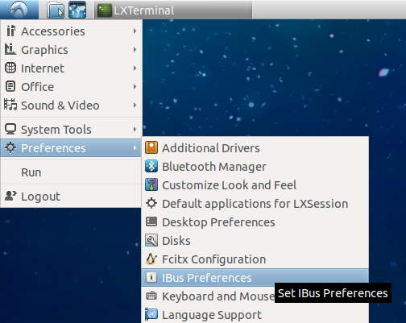

  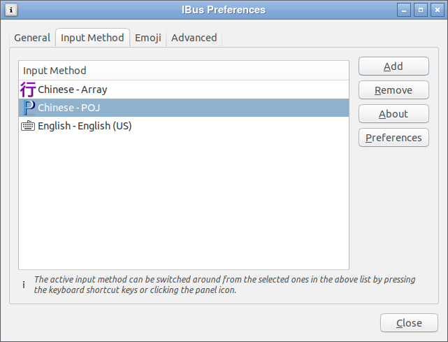

* Select IBus as the `Keyboard input method system`.

  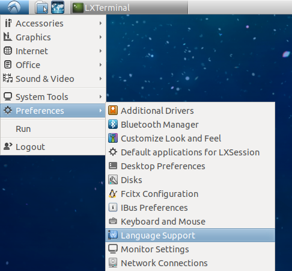

  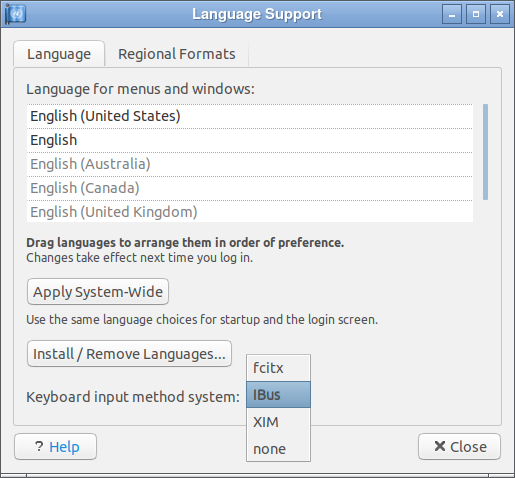

* __Congrats!__ You should be able to use POJ input method now.

## Setup (Ubuntu 18.04; not confirmed, yet...)
* (I need to check this step...) <s>Make sure you have `zh_TW.UTF-8` locale enabled.
  Or you can just run `sudo locale-gen zh_TW.UTF-8` to generate it.
  * (Optional) Check the file of `/etc/locale.gen`,
    the line of `zh_TW.UTF-8 UTF-8` (it's located near the bottom of the file)
    should has been uncommented.</s>

* Install [Gawk](https://www.gnu.org/software/gawk/): `sudo apt install gawk`

* Clone the repo and `cd ./poj_ibus_table`.
  * <s>(Optional, for first time setup) Add the icon by `sudo cp pics/ibus-poj.svg /usr/share/ibus-table/icons/`.</s>
    (This step has no effect now, and I cannot find method to solve it... Orz)

* Run `bash update_poj_db.sh` and the script will do all the setup works for you.
  * If you want, just check the script to see all the setup steps,
    and manually run them one by one.

* In system `Settings`, select `Region & Language`.

  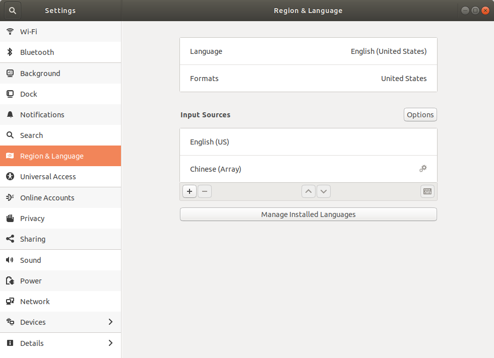

* Click the `+` button to add input resources.

  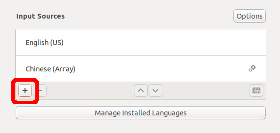

* Choose `Chinese (Taiwan)`... (Aargh... All are under Chinese... ಠ_ಠ

  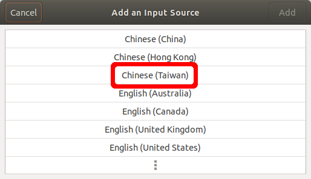

* Choose `Chinese (POJ)`...

  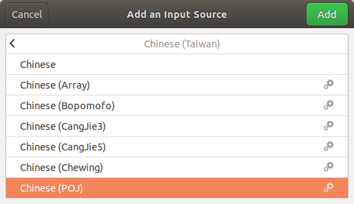

* Then you can see that POJ has been added.

  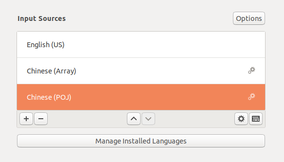

* Finally, use `Super(Win)+Space` to toggle between input methods.

  

## Trouble shooting

__NOTE__: The following screenshot was captured in Lubuntu 18.04.

* If you find there're some Han characters missing in the selecting list, 
  click the icon on system tray and set **Chinese mode** to be **All Chinese characters**.

  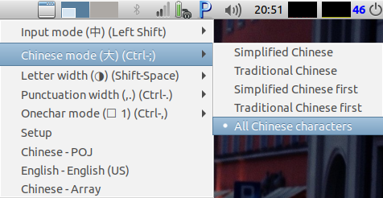

* If you get only Han characters but no POJ showing up, click the icon on system 
  tray and set **Onechar mode** to be **Multiple character match** 
  (Thank Achèng for reporting this issue).

  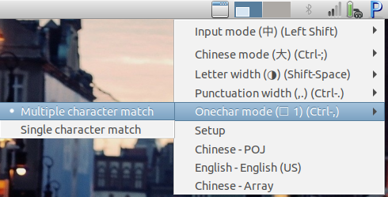

## Known bugs/issues

* [2023-04-15] The dynamic adjust function has no effect on single lomaji with accents (e.g., ê). (at least in Xubuntu 22.04)
* [2023-04-22] Because `a` could be the letter or the "1st tone selector", combined with the above issue, it might make some words cannot be listed in the first page. A workaround is add `z` at the end of the words in `ibus_han_poj_123.txt` so that we can use `z` instead of `a` to select wanted words quickly (see `oaⁿ` at lines 6303 to 6306 of `ibus_han_poj_123.txt`). 
* <s>In some situations (e.g., after selecting Han characters) the input method might switch to full-width mode, and you need to press `Shift+Space` key once to back to normal input mode.</s>
* The system does not show the icon (`pics/ibus-poj.svg`) in Ubuntu 18.04,
  but everything is okay in Lubuntu 18.04...
  If you know how to solve it, let me know please.

---

# Modify the table content to fit your need

If you want to modify the table content, read on.

## Update your own poj.db

* Edit `ibus_han_poj_123.txt` to fit your need
  * __NOTE__: Use `TAB` as the separator for the items. `SPACE` will not work.
* Run `bash update_poj_db.sh`

### The frequency ranges

In `table_converter.sh`, the phrases' frequencies less than 10 have been preserved for punctuations, digits, and letters.
For words/phrases (i.e., combinations of single syllables), the frequencies have been set to be 300 or more.
Therefore, when you edit `ibus_han_poj_123.txt` to add your own characters, please note __that the frequencies should be in the range of `10-299` or they won't be converted__.

The usage of the phrases' frequencies are listed in the following table.

| Frequency range | Usage | Example |
| --- | --- | --- |
| 0-9 | punctuations, digits, and letters. | ,.;123abcABC |
| 10-99 | seldom used Han characters and emoji | |
| 100-199 | general Han characters | |
| 200-299 | LMJ/POJ | tâi, gí, ...|
| 300- | Words/Phrases | Tâigí, Tâi-gí, 台語, ... |

### File list
| File name | Description |
|---|---|
| poj-holo.cin | The original cin table, which contains only Han characters. |
| **ibus_han_poj_123.txt** | This is the `<your_ibus_table.txt>` file, which you should edit to create your own ibus table. |
| ibus_han_poj_asd.txt | Using **asdfghjkl** instead of **123456789** as the input keys, so that the number keys can be used to select between listed words. It is generated by `table_converter.sh`. |
| poj.db | The ibus table generated from `ibus_poj.txt`. |
| **update_poj_db.sh** | Use this to create/update the poj.db and add it to your system. |
| table_converter.sh | Use it to convert `ibus_han_poj_123.txt` to `ibus_han_poj_asd.txt`; it has been included in `update_poj_db.sh`. |
| ./pics/ibus-poj.svg | The icon file. |
| lomaji.py | The original file which contains the (incomplete) POJ unicode list. |
| print_poj_list.py | Used to print out the Unicode list in `lomaji.py`. |

---

## TODO
* <s>To add Lô-má-jī ahead of the Han characters.</s>
* <s>To tune the usage frequency of some Han characters.</s>
* To add phrases into the table.
* To adjust the Han characters.

## Ref.
* [ibus上安裝大易輸入法](http://120.114.52.240/~T093000298/blog?node=000000103)
* [在 iBus 加入大易輸入法](http://jamyy.us.to/blog/2013/12/5653.html)

