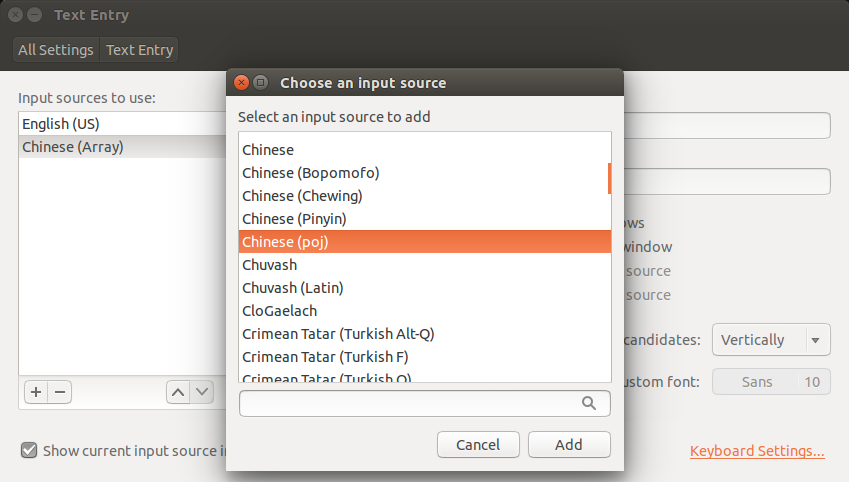
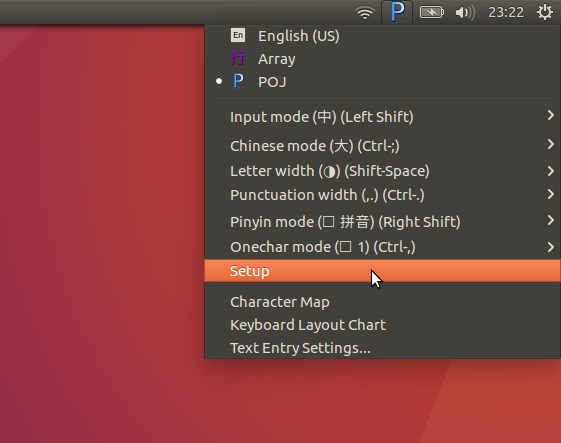
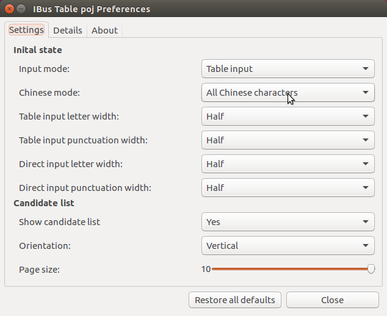

# poj_ibus_table

## Purpose
The purpose of the project is to create an IBus table for POJ users.
The table was modified from one of the cin-tables ([poj-holo.cin](https://github.com/chinese-opendesktop/cin-tables)).

## Test Environment
The table has been created and tested in Ubuntu 16.04.

## Usage

### Pre-processing (optional)
Create `poj.db` from the cin table

* Go to you working directory.
* Prepare the cin table `poj-holo.cin`
* Copy the file for editing:

    `$cp /usr/share/ibus-table/table/template.txt <ibus_han_poj_123.txt>`
* Convert the cin table to IBus format by using:

    `$awk '/\%chardef begin/{f=1;next}/\%chardef end/{exit}f' poj-holo.cin | awk '{count[$1]++}{print $1"\t"$2"\t"101-count[$1]}' | tr '[A-Z]' '[a-z]' >> ibus_han_poj_123.txt`
* Edit `ibus_han_poj_123.txt` to fit your need

### Installation/Setup (for first-time users)
Create/update the `poj.db` and add it to you system (long version)

* Create the table:
  `$ibus-table-createdb -s ibus_han_poj_123.txt -n poj.db`
* Copy the table to its working directory:
  `$sudo cp poj.db /usr/share/ibus-table/tables/`
* Add the icon:
  `sudo cp pics/ibus-poj.svg /usr/share/ibus-table/icons/`
* Restart IBus:
  `$ibus-daemon -x -r -d`
* Add POJ input method in the setup of IBus.
  

Create/update the poj.db and add it to you system (short version)

* Run `$bash update_poj_db.sh`, which will do the above steps for you.
* Add POJ input method in the setup of IBus as mentioned above.

### Update your own poj.db

* Edit `ibus_han_poj_123.txt` to fit your need
* Run `$bash update_poj_db.sh`

## Note

In `table_converter.sh`, the phrases' frequencies less than 10 have been preserved for punctuations, digits, and letters.
For words/phrases (i.e., combinations of single syllables), the frequencies have been set to be 300 or more.
Therefore, when you edit `ibus_han_poj_123.txt` to add your own characters, please note __that the frequencies should be in the range of `10-299` or they won't be converted__.

The usage of the phrases' frequencies are listed in the following table.

| Frequency range | Usage | Example |
| --- | --- | --- |
| 0-9 | punctuations, digits, and letters. | ,.;123abcABC |
| 10-99 | seldom used Han characters | |
| 100-199 | general Han characters | |
| 200-299 | LMJ/POJ | tâi, gí, ...|
| 300- | Words/Phrases | Tâigí, Tâi-gí, 台語, ... |

## Trouble shooting

* If you encounter the following message as running the update_poj_db.sh script:

    `awk: line 29: function gensub never defined`

    it means that you need to install `gawk`.

* After the installation, you may be need to log out and in again, and remember to add the POJ input method from the IBus GUI as shown above.

* If your POJ input method fails to adapt the given icon (ibus-poj.svg), try to install `ibus-chewing`, reboot the system, and then add POJ input method from the IBus GUI again. (I don't know the reason, but this work-around works for me.)

* If some of the Han characters won't shown in the selecting list, click the icon on system tray and set **Chinese mode** to be **All Chinese characters**.

  

  

## Known bugs

* <s>The dynamic adjust function don't work as expected.</s>
* <s>In some situations (e.g., after selecting Han characters) the input method might switch to full-width mode, and you need to press `Shift+Space` key once to back to normal input mode.</s>

## File list
* poj-holo.cin: The original cin table, which contains only Han characters.
* **ibus_han_poj_123.txt**: This is the `<your_ibus_table.txt>` file, which you should edit to create your own ibus table.
* ibus_han_poj_asd.txt: Using **asdfghjkl** instead of **123456789** as the input keys, so that the number keys can be used to select between listed words. It is generated by table_converter.sh.
* poj.db: The ibus table generated from ibus_poj.txt.
* **update_poj_db.sh**: Use this to create/update the poj.db and add it to your system
* table_converter.sh: Use it to convert ibus_han_poj_123.txt to ibus_han_poj_asd.txt; it has been included in update_poj_db.sh.
* ibus-poj.svg: The icon file.
* lomaji.py: The original file which contains the (incomplete) POJ unicode list.
* print_poj_list.py: Used to print out the unicode list in lomaji.py.

## TODO
* <s>To add Lô-má-jī ahead of the Han characters.</s>
* <s>To tune the usage frequency of some Han characters.</s>
* To add phrases into the table.
* To adjust the Han characters.

## Ref.
* [ibus上安裝大易輸入法](http://120.114.52.240/~T093000298/blog?node=000000103)
* [在 iBus 加入大易輸入法](http://jamyy.us.to/blog/2013/12/5653.html)

